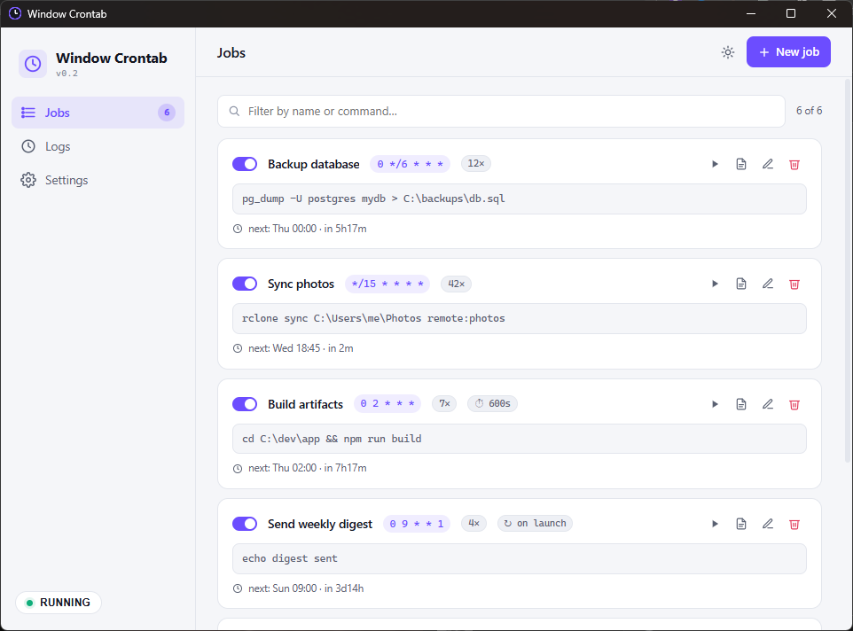

# Window Crontab

A small Windows tray app that runs commands on a schedule.

Schedule any command using classic 5-field cron syntax. Window Crontab lives in your system tray, fires the job at the right minute, captures output to a per-job log, and stays out of your way.

[](LICENSE)
[](https://github.com/evil1morty/crontab/actions/workflows/release.yml)
[](https://tauri.app)

<p align="center">
  
</p>

## Why

Windows Task Scheduler exists, but it's heavy, hard to script, and the UI is from 2003. Window Crontab is the small thing in the tray that runs your `npm run cron` every five minutes without a 12-step wizard.

It is one 3 MB executable. No background service, no daemon, no Node, no Python. Just an exe.

## Quick start

1. Download `crontab.exe` from the [Releases](https://github.com/evil1morty/crontab/releases) page.
2. Run it. It drops into your system tray.
3. Open the window (click the tray icon, or double-click). Hit **+ New job**.
4. Fill in a name, a cron schedule, and a command. Save.
5. Watch runs land on the **Logs** tab.

To autostart with Windows itself: **Settings**, then "Start with Windows (hidden in tray)".

## Features

**Scheduling**
- Classic 5-field cron (`* * * * *`) plus `@hourly`, `@daily`, `@weekly`, `@monthly`
- Live "next run in 2h 14m" preview as you type the schedule
- Hot-reload of the config TOML. Edit it in any editor, changes pick up at the next minute boundary
- Master pause toggle in the tray and sidebar

**Per-job options**
- Timeout: kill the child if it runs longer than N seconds
- Auto-disable after N runs (useful for one-shot or capped retries)
- Skip if the previous run is still alive (default), or opt into concurrent runs
- Run once when Window Crontab launches

**Logs and output**
- Per-job append-only log file at `%LOCALAPPDATA%\claude-cron\data\logs\<job>.log`
- "View output" button on every card opens that log in Notepad
- In-app Logs tab with status (ok, fail, timeout, skipped) and exit code
- Run history persists across restarts

**UI**
- Light and dark themes, persisted across launches
- Search and filter on the jobs list
- Keyboard shortcuts: `Ctrl+N` new job, `Ctrl+W` or `Esc` hide window, `1` `2` `3` switch tabs
- Hide on close, autostart on login (registers `HKCU\...\Run` with `--hidden`)

## Cron syntax

Standard 5-field: `minute hour day-of-month month day-of-week`.

| Want                       | Schedule       |
| -------------------------- | -------------- |
| Every minute               | `* * * * *`    |
| Every 15 minutes           | `*/15 * * * *` |
| Every hour at :00          | `0 * * * *`    |
| Daily at 9:00              | `0 9 * * *`    |
| Weekdays at 9:00           | `0 9 * * 1-5`  |
| Mondays at 8:00            | `0 8 * * 1`    |
| Daily at midnight (alias)  | `@daily`       |

The form has chips for the common ones. Click to fill.

## Command tips

Commands run via `cmd /C <your-command>` from the app's working directory (typically `C:\Windows\System32`). For project-relative scripts, `cd` first:

```
cd C:\path\to\project && npm run cron
```

A `.bat` script is the no-deps option:

```
"C:\Users\you\scripts\backup.bat"
```

## File locations

| What                     | Path                                                       |
| ------------------------ | ---------------------------------------------------------- |
| Config (hot-reloaded)    | `%APPDATA%\claude-cron\config\crontab.toml`                |
| Per-job logs             | `%LOCALAPPDATA%\claude-cron\data\logs\<sanitized-name>.log`|
| Run history (Logs tab)   | `%LOCALAPPDATA%\claude-cron\data\history.json`             |

## Build from source

```sh
cargo build --release
# binary at target\release\crontab.exe
```

For the MSI installer:

```sh
cargo install tauri-cli --locked
cargo tauri build
# msi at target\release\bundle\msi\
```

Build deps are stock Rust plus the `image` crate (used by `build.rs` to generate icons on first build). No Node, no npm, no Tailwind compile step.

## How it works

The Rust side runs a single scheduler thread that wakes once per minute, reads the in-memory config, and fires anything matching the current minute. Each fired job spawns its own thread which runs `cmd /C <command>` with stdout and stderr piped to the per-job log file.

The frontend is plain HTML, CSS, and JavaScript talking to Rust through Tauri's `invoke` bridge. No bundler, no framework. CSS uses native variables for theming. Tauri 2 embeds the assets into the exe at build time.

WebView2 is used for rendering. It ships with Windows 11 and is installed via Edge on Windows 10.

## License

MIT, see [LICENSE](LICENSE).
